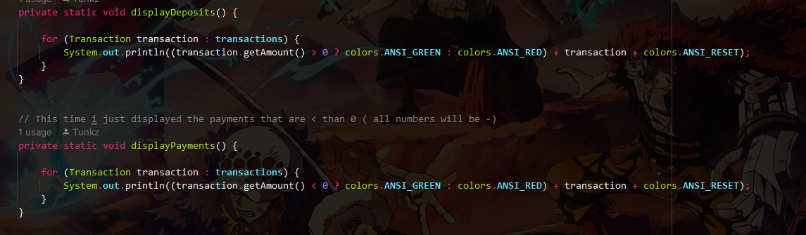

<h1 style="text-align: center;"> FINANCIAL TRACKER CAPSTONE 1</h1>

<u>
<h2 style="text-align: center;"> Brief explanation about the project</h2></u>
This capstone is about a financial tracker that records financial transactions, displays them,
and keeps track of the date & time that the transactions took effect. This means that, for every 
transaction that was taken by a certain period of time, will be recorded and can be displayed by 
one of the options which is called <strong>ledger</strong>. The ledger is a book of accounts in which accounting 
transactions are recorded. One of the rare features that i added, is that when inside the ledger and 
you want to display all payments, will be colored in green and the rest will be print in red text color,
so as the payments, they will be displayed in green and the payments in red.
<u>
<h2 style="text-align: center;"> Challenges and solutions </h2></u>
Some of the challenges that I faced during my presentation were thinking how to put in the correct code
I over think about it and that wasn't helping me at all. I fixed that issue by breaking down all
the information that needed to be in each method, do my own research, went through old exercises in Github
that we did in class, and help from my surroundings. I used every available resource to make sure i 
understand and be capable of adding what needed to be added.
<h2 style="text-align: center;"> Future Work </h2></u>
I'll be adding a smartdraw chart, so you can have a preview of the capstone that will let you see how
the capstone is in a chart.
<h2 style="text-align: center;"> Special feature </h2></u>
A special feature that i added and would like to highlight, will be the **ANSI_RED** command.
It makes the color of your text unique and easy to identify if it's something positive or negative
Green = positive, Red = negative. (this apply to most cases, but not every case)
<h2 style="text-align: center;"> Screenshots & Gif's </h2></u>

This shows the code at a speed i wanted it to run, so i can highlight the difference between the 
text colors, positive numbers, and negative numbers.

  
Creating a colors class so I can color my text the color I want (as well as the background but 
i didn't add that feature in my code)

What this does, is that when the displayDeposits gets print out, if the transaction amount is 
  . > 0 all the payments will be displayed in green color and the rest will print in red. So as 
the displayPayments method, all payments will be displayed in green and the rest will be colored in red.
<h2 style="text-align: center;"> Appreciation </h2></u>
I'd like to thank my program manager, **Gabe**, **Hamza**,**Christian**,**BigBroJoshua**, and the rest of the class
to be there when needed, for the help when it came to debugging, for the resources provided to make sure my work 
was done, and for last but not least, **Raymond**. For being such a very patient instructor, although we ask a lot of 
repetitive questions, but you always got us out of doubts when we were almost completely out of the game.

